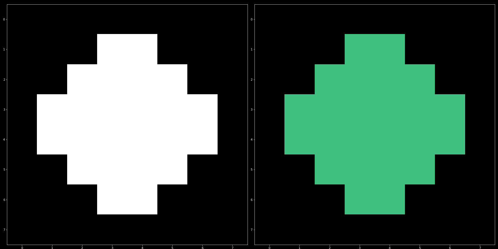
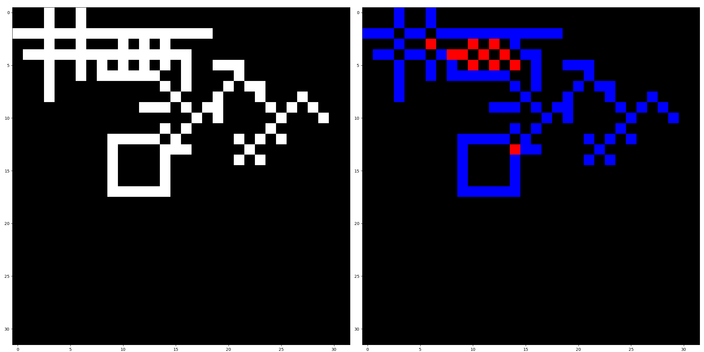
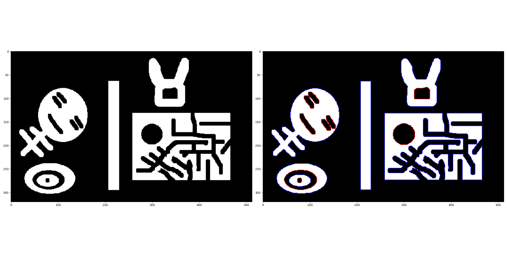
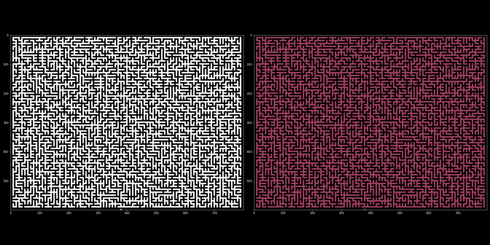
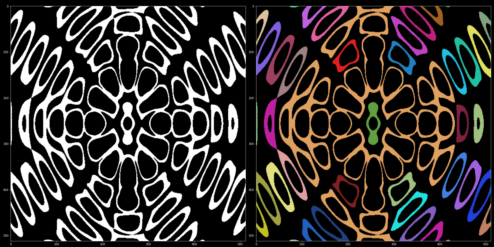

### Implement of ```A linear-time component-labeling algorithm using contour tracing technique```







---

## Reference
+ [paper](https://www.semanticscholar.org/paper/A-linear-time-component-labeling-algorithm-using-Chang-Chen/61e05914f1889c8a1f52a96a831a8ba538dab6cb)

+ [blob](https://github.com/BlockoS/blob)
